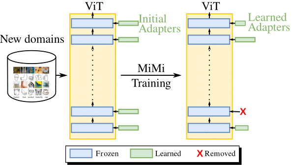
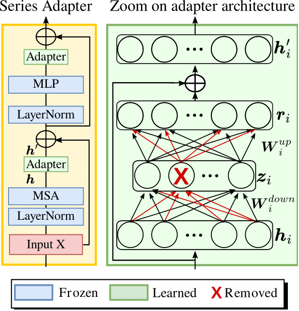

# Mini but Mighty: Finetuning ViTs with Mini Adapters

<div align="center">

<div>
    <a href='' target='_blank'>Imad Eddine MAROUF</a><sup>1</sup>&emsp;
    <a href='' target='_blank'>Enzo Tartaglione</a><sup>1</sup>&emsp;
    <a href='' target='_blank'>Stéphane Lathuilière </a><sup>1</sup>
</div>

<div>
<sup>1</sup>Telecom-Paris, Institut Polytechnique de Paris&emsp;
</div>
</div>

The code repository for "[Mini but Mighty: Finetuning ViTs with Mini Adapters](https://arxiv.org/abs/2311.03873)"(_WACV2024_) in PyTorch.

## Abstract

Vision Transformers (ViTs) have become one of the dom-
inant architectures in computer vision, and pre-trained ViT
models are commonly adapted to new tasks via finetuning.
Recent works proposed several parameter-efficient transfer
learning methods, such as adapters, to avoid the prohibitive
training and storage cost of finetuning.
In this work, we observe that adapters perform poorly
when the dimension of adapters is small, and we pro-
pose MiMi, a training framework that addresses this is-
sue. We start with large adapters which can reach high
performance, and iteratively reduce their size. To en-
able automatic estimation of the hidden dimension of ev-
ery adapter, we also introduce a new scoring function,
specifically designed for adapters, that compares neuron
importance across layers. Our method outperforms ex-
isting methods in finding the best trade-off between accu-
racy and trained parameters across the three dataset bench-
marks DomainNet, VTAB, and Multi-task, for a total of 29
datasets. 

<p align="center">
  
  &nbsp; &nbsp; &nbsp; &nbsp;  <!-- Spaces to create some gap -->
  
</p>

## Requirements
### Environment
install the conda environment using the provided yml file.

## Running scripts
Please follow the settings in the `exps` folder to prepare your json files, and then run:

```
python main.py --config $CONFIG_FILE
python few_shot_prune.py --config $CONFIG_FILE
```
## Citation

If you find this work helpful, please cite our paper.

```bibtex
@misc{marouf2023mini,
      title={Mini but Mighty: Finetuning ViTs with Mini Adapters}, 
      author={Imad Eddine Marouf and Enzo Tartaglione and Stéphane Lathuilière},
      year={2023},
      eprint={2311.03873},
      archivePrefix={arXiv},
      primaryClass={cs.CV}
}
